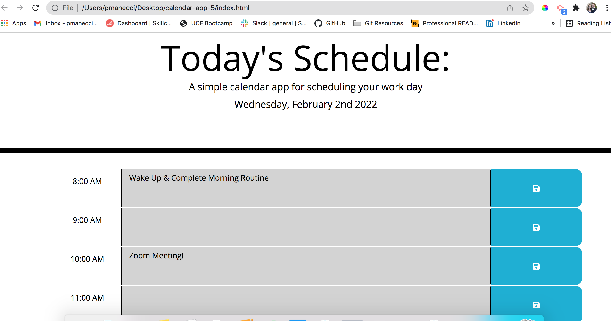

# calendar-App

## Description

A simple calendar app for scheduling your work day

## Table Of Contents

- [calendar-app](#calendar-app)
  - [Description](#description)
  - [Table Of Contents](#table-of-contents)
  - [Installation](#installation)
  - [Usage](#usage)
  - [Questions](#questions)

## Installation

No installation required! 

## Usage

Visit and use the deployed application here! The save button will store any events or tasks typed into each timeblock to local storage and remain as long as the browser page remains open!
  
## Questions

Any questions, please contact Patty Manecci

My email address is: pmanecci@gmail.com
My github profile is https://github.com/PManecci
